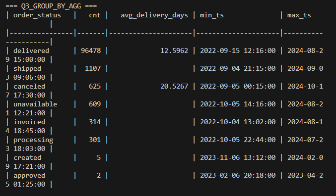
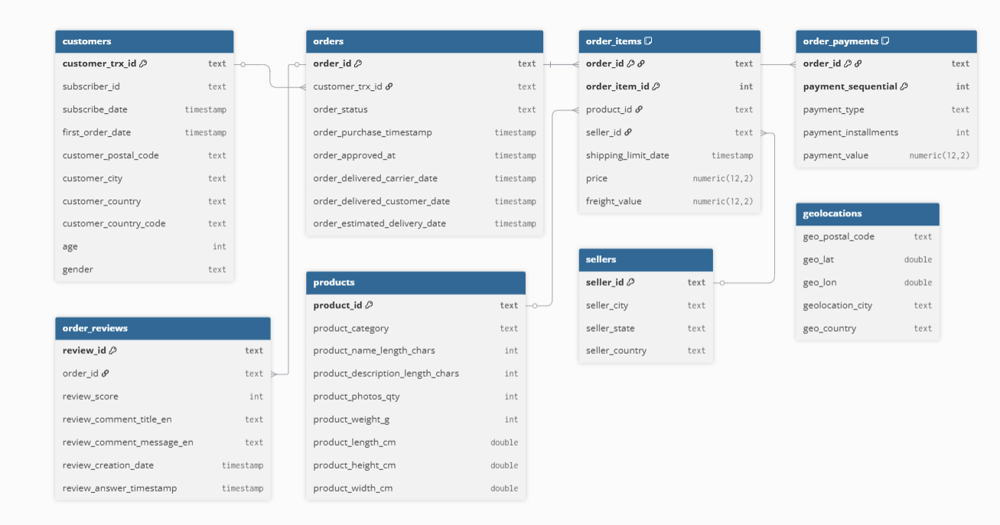

# SilkStep Commerce 
## Company & role
I work as a **Data Analyst** at **SilkStep Commerce**, a mid-size Central Asian e-commerce marketplace connecting customers with vetted third-party sellers (electronics, home & living, beauty, apparel).

## Project overview
This repository contains a PostgreSQL analytics setup for SilkStep Commerce.  
It imports raw CSVs into a relational schema, validates structures (types, PK/FK), runs baseline SQL checks (LIMIT, WHERE+ORDER BY, GROUP BY, JOIN), provides 10 analytical SQL queries (`queries.sql`), and includes a small Python script (`main.py`) that connects to the DB and prints results to the terminal.

## Main analytics (screenshot)



---

## ER diagram



## How to run (step-by-step)

### Requirements
- PostgreSQL running locally 
- Python 3.8+

## Tools & resources
- PostgreSQL + psql
- Python: psycopg2-binary, tabulate
- (optional) Apache Superset (dashboards)
- (optional) dbdiagram.io / Mermaid (ER diagram)
## Dataset

This project uses the **Fecom Inc — E-com Marketplace Orders & CRM** dataset from Kaggle:

- **Kaggle page:**  
  https://www.kaggle.com/datasets/cemeraan/fecom-inc-e-com-marketplace-orders-data-crm


### Create DB and apply schema (psql)
```sql
-- inside psql
CREATE DATABASE fecomdb; \c fecomdb
\i 'C:/fecom-assignment1/schema.sql'
-- quick visibility check after you import CSVs:
SELECT * FROM orders LIMIT 10;


